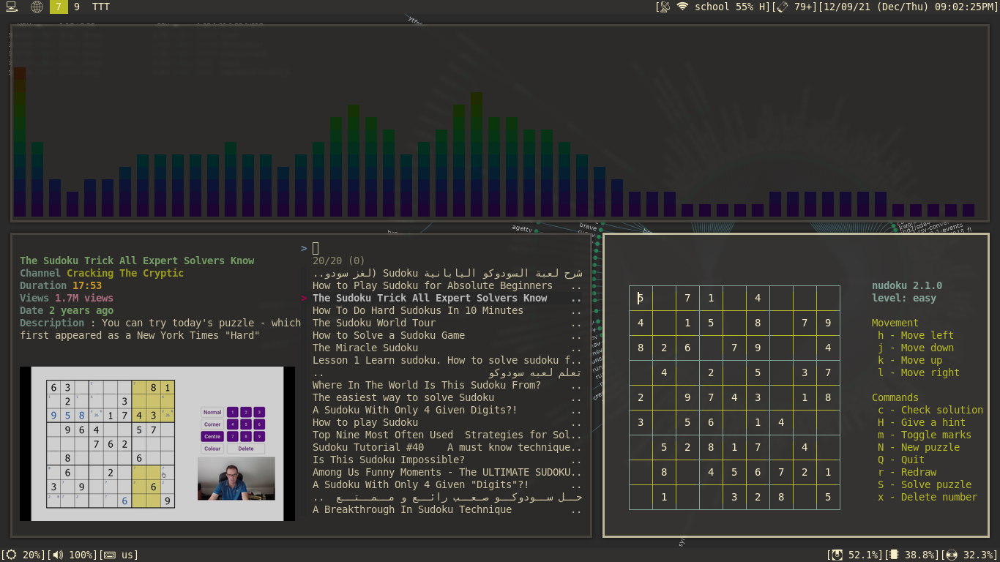
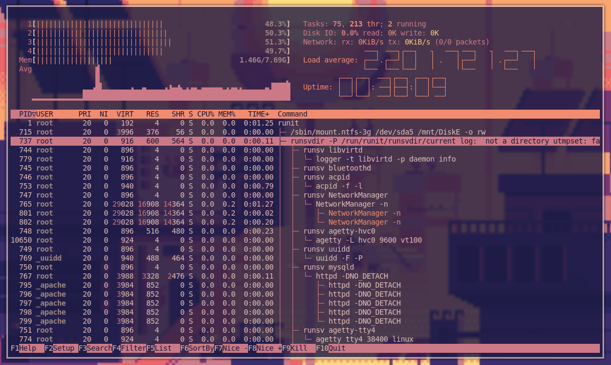
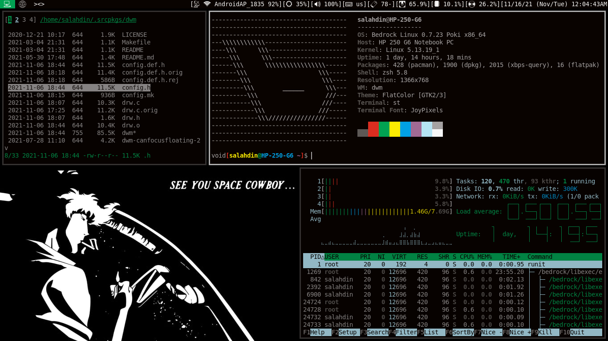
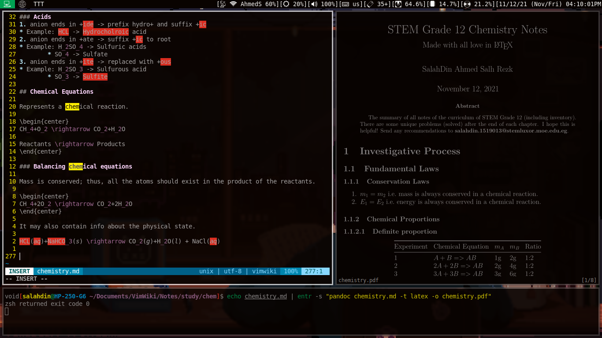
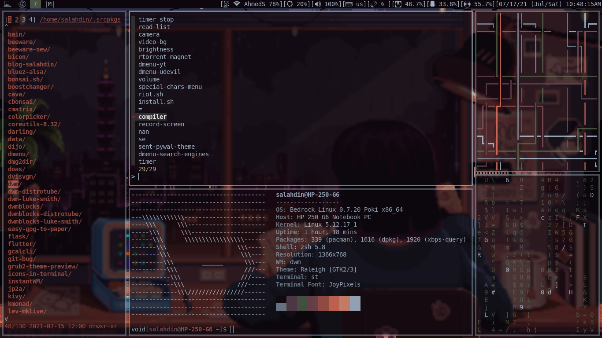
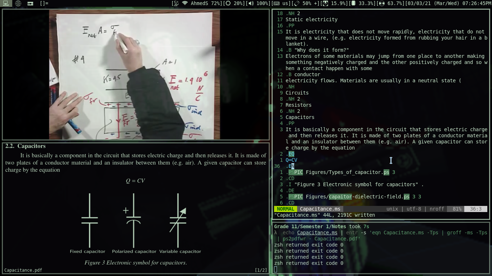
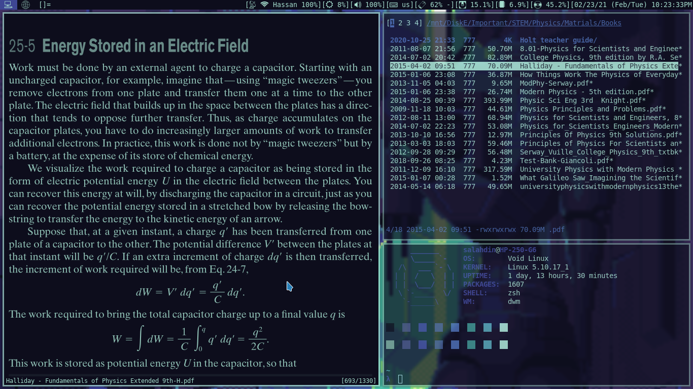
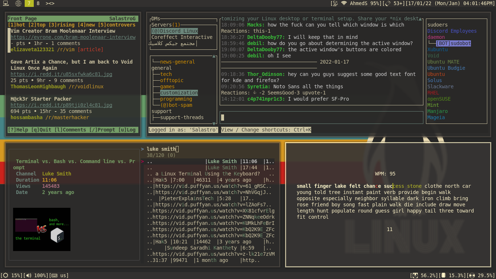

+++
layout = "index"
framed = true
+++

# LEV Linux
is a customized Void Linux distribution that focuses on functionality and
minimalism.

|                      |               |
| -------------------- | ------------- |
| **C Library**        | *musl*        |
| **Window manager**   | *DWM*         |
| **Status bar**       | *DWM Blocks*  |
| **Terminal**         | *ST*          |
| **Shell**            | *ZSH*         |
| **Lock screen**      | *SLock*       |
| **Browser**          | *QuteBrowser* |
| **Document reader**  | *Zathura*     |
| **File manager**     | *NNN*         |
| **Image viewer**     | *SXIV*        |
| **Video player**     | *MPV*         |
| **Password manager** | *pass*        |
| **Email client**     | *NeoMutt*     |
| **Text editor**      | *NeoVIM*      |
|                      |               |

| [AND MORE](/software) |
| --------------------- |

## Screenshots

